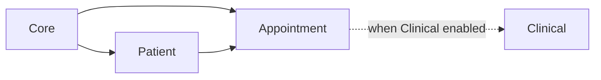

# Appointment module

**In one sentence:** The Appointment module is the **scheduling desk inside the software**—it books **who** sees **which provider** or **which location**, at **what time**, tracks **status** (booked, checked in, completed, cancelled), and keeps hooks for **calendar views** and **downstream systems** when appointments change.

## Why this module exists

Hospitals run on **time**. Reception and clinics need a reliable way to reserve a slot, move it when plans change, record that the patient **arrived** (check-in), and mark **no-shows** or **cancellations** with reasons. That schedule must connect to **patients** and often to **clinical** workflows so staff are not re-typing the same story in two places.

## Where Appointment fits in FlowRise

- **Depends on Core** (branches, locations, departments) and **Patient** (every appointment is for a person).
- **Integrates with Clinical** when the Clinical module is enabled: the appointment service provider can register **header actions** on clinical workspace pages (for example, patient list, timeline, profile) so booking actions appear where clinicians already work.

## What you can do with it (everyday language)

- **Create and edit appointments** with start and end time, location, department, and primary provider where applicable.
- **Change status** through the lifecycle (for example: booked → checked in → completed, or cancelled with a reason).
- **Use a calendar-oriented UI** (the module integrates with the **Guava Calendar** package for rich calendar rendering—see developer note below).
- **Prepare for external messaging**: important lifecycle changes can enqueue rows in an **appointment sync outbox** so integrations can pick them up reliably (see `AppointmentSchedulingService` and `AppointmentSyncOutbox` in code).

## How it works (simple)

1. Staff choose a **patient** and a **time window**, then save an appointment.
2. The system stores the row, links it to **branch / location / department / provider** fields as filled in, and updates **status** timestamps when staff record check-in or completion.
3. When the scheduling service records certain transitions, it may **append an outbox record** describing the event for integration workers or external systems.
4. Optional bindings (registered in `AppointmentServiceProvider`) help translate appointments to **FHIR-style** structures or **messaging adapters** when you build hospital-to-hospital workflows—those are developer-facing contracts, not something front desk staff must understand.

## What is inside this folder (high level)

| Path | Purpose |
|------|---------|
| `app/Models/` | `Appointment`, sync outbox, and related persistence. |
| `app/Classes/Services/` | Scheduling, transformers, adapters—**business and integration logic**. |
| `app/Classes/Actions/` | Actions wired into other modules’ pages (for example, clinical workspace). |
| `app/Filament/` | Appointment cluster, resources, calendar pages, widgets. |
| `app/Policies/` | Authorization for appointment records. |
| `app/Contracts/` | Interfaces for FHIR or SIU-style adapters. |
| `database/migrations/` | Schema for appointment tables. |

## Dependencies

- **Core** and **Patient** (`composer.json` / `module.json`).
- **Composer package** `guava/calendar` for calendar UI components.

**Module status** (how complete Appointment is versus other modules): [Module status](../../docs/shared/module-status.md).

## For developers

- **Namespace:** `Modules\Appointment\...`
- **Service provider:** `Modules\Appointment\Providers\AppointmentServiceProvider`
  - Registers `Gate::policy` for `Appointment`.
  - Binds `FhirAppointmentTransformerContract` and `SiuMessageAdapterContract` for interoperability code paths.
  - Registers **clinical workspace** header actions when the Clinical module is enabled (see `registerClinicalWorkspacePatientPageHeaderActions()`).
- **Outbox pattern:** `AppointmentSchedulingService` writes to `AppointmentSyncOutbox` on key lifecycle events for resilient downstream sync—inspect that class before claiming a feature exists beyond what it emits.
- **Calendar UI:** Filament pages/widgets use **Guava Calendar**; the `Appointment` model implements `Eventable` to feed calendar events.
- **Tests:** under `tests/`; run from the repository root with a path into `Modules/Appointment/tests`.
